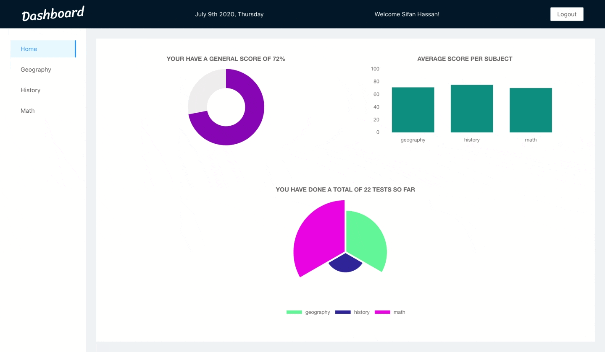
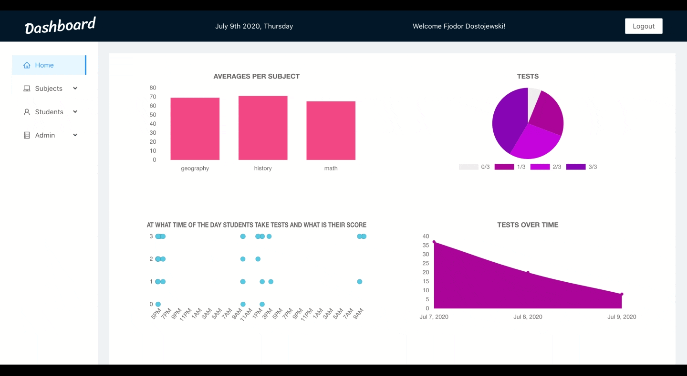

# Dashboard

## What is this and who am I?

In short: this is a dashboard where students and teachers can keep track of grades and progress for multiple subjects/students. For the details on the functionality see the [user stories](#userStories).

A live version of the dashboard with dummy data can be found [here](https://compassionate-raman-97ce78.netlify.app/).

### Log in with:

Teacher: fjodor@dostojewski.com, 123

Teacher: sebastian@bach.com, 123

Student: sifan@hassan.com, 123

Student: jack@sparrow.com, 123

## Who am I?

I am part of class #40, attending an 11 week JavaScript bootcamp at Codaisseur.

For seven weeks the teachers at Codaisseur have been teaching us a variety of [skills](https://willemverbuyst.github.io/threeJS-react-list/) to prepare us for a career in full-stack web-development. This project is the fruit of this. We got two weeks to build a project from scratch showcasing the techniques we have learned and explore some _terra icognita_.

## Table of contents

- [App demos](#appDemos)
- [Technologies used](#technologiesUsed)
- [Goals](#goals)
- [User stories](#userStories)
- [Data models / wireframes / project board](#models-wireframe-projectboard)
- [Git workflow](#gitWorkflow)
- [Server repository](#serverRepo)
- [Installation](#installation)

## App demos

## Technologies used

### Front-end

- React
- Redux
- Chart.js
- AntDesign

### Back-end

- Sequelize
- PostgreSQL
- Server with Express
- Authorization middleware

## Goals

- The goal was to create an application with React and Redux, and build a server with Express and Sequelize.
- Explore new technology independently like Chart.js
- Practice good preparation with the use of wireframes, data models and user stories.
- Follow disciplined Git usage, i.e. make use of commits, branching and pull requests.

## User stories

### As a student ...

- As a student I want to sign up/login in order to use the dashboard and see my grades/progress.
- When logged in I will see an overview (sidebar) of the classes I am attending.
- On the main page I will see a chart with my average grade for each subject.
  -By clicking on a subject in the sidebar I will see an overview of all my scores (per test) for that subject.
- On this details page there is a button to do a test for that subject.
- I will see a 'finish test' button, and get a display of a message with the result.

### As a teacher ...

- As a teacher I want to sign up/login in order to use the dashboard and see my student details.
- When logged in, I will get an overview with all my students and subjects that I am teaching (sidebar).
- On the main page I will see a chart with the average grade for the subjects.
- I can use the links in the sidebar to see the details for a student, or subject.
- I can click a link in the sidebar to see the list of existing mc questions for a subject and add a mc question.
- As a teacher I can add a subject

## Data models / wireframes / project board

[Data models](https://app.lucidchart.com/invitations/accept/d09a0ec5-92f6-4ac7-b203-e96f708609db)

[Wireframes](https://drive.google.com/file/d/1CMpn7W91WxH8KU1kURMbLTiAyhFeMNgq/view?usp=sharing)

[Project board](https://github.com/willemverbuyst/school-dashboard-frontend/projects/1)

## Git workflow

Work on the development branch. Create a new branch for each feature and commit regularly. Push to github and make a pullrequest to the development branch. When project was finished I merged it into the master for deployment.

Click the link to a sample of a pull request.

[Feat data teacher](https://github.com/willemverbuyst/school-dashboard-frontend/pull/21)

## Server repository

The repository for the backend can be found [here](https://github.com/willemverbuyst/school-dashboard-backend).

This is a REST-ful API using Express.js.

The database is built using Postgres and Sequelize.
The data model. link

## Installation

When you want to use this dashboard you will also have to install the server. The server details can be found [here](https://github.com/willemverbuyst/school-dashboard-backend).

1. Clone the repo
2. Run npm install (to install all the dependencies)
3. In the config folder(link) add the link to your server.

You will start with an empty dashboard. Steps to build up this dashboard.

4. Teacher(s) sign up.
5. Teacher add subject(s)
6. Teacher add questions for that subject
7. Students sign up
8. Students do tests
